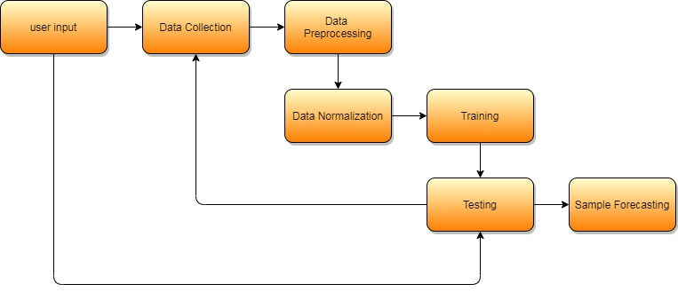
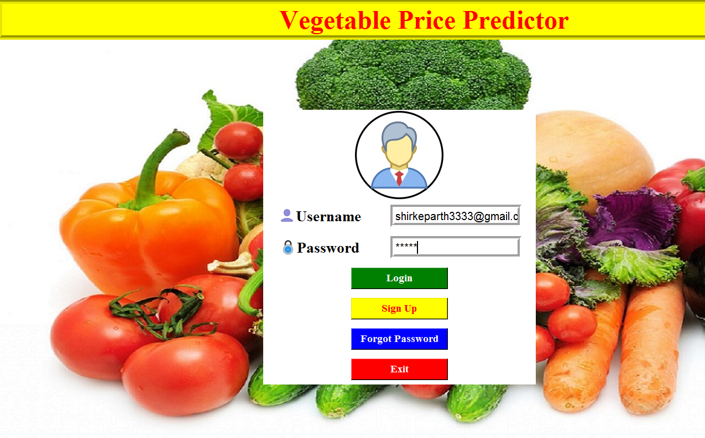
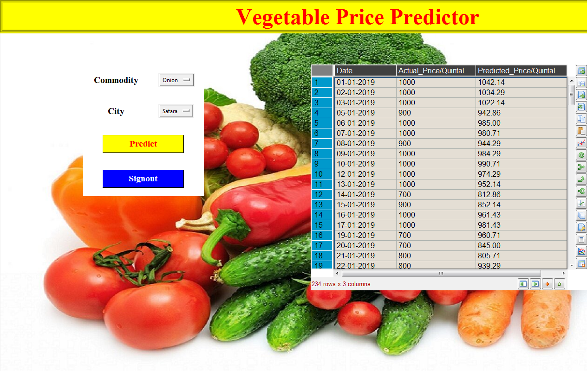
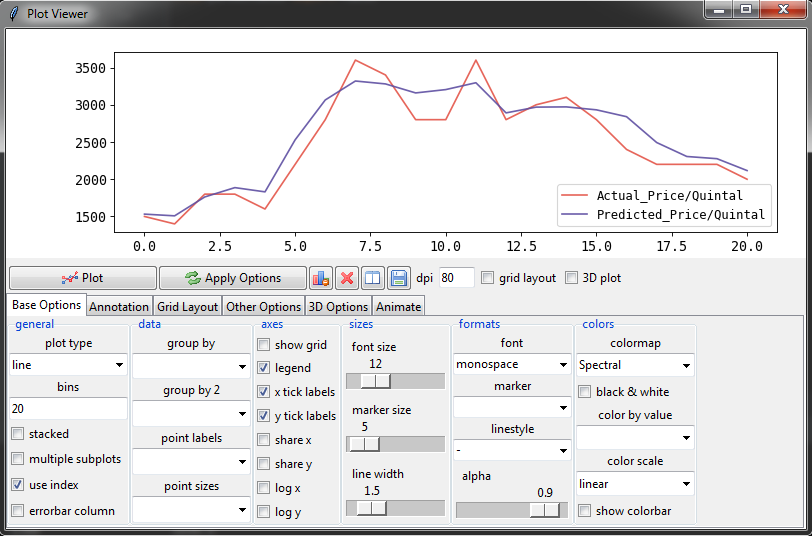
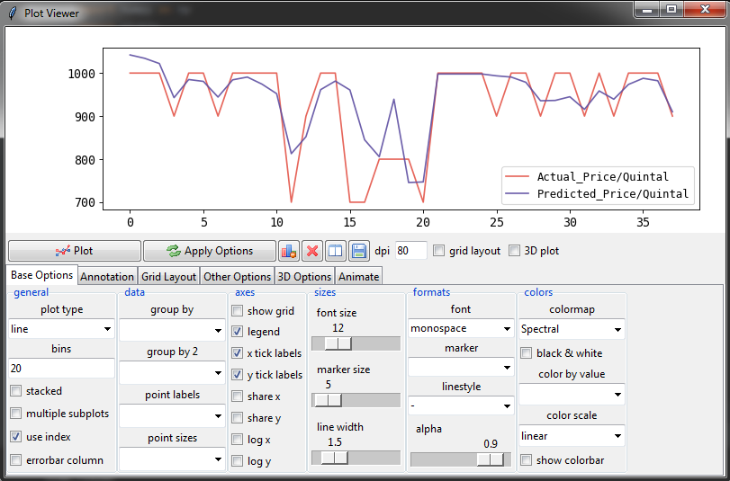
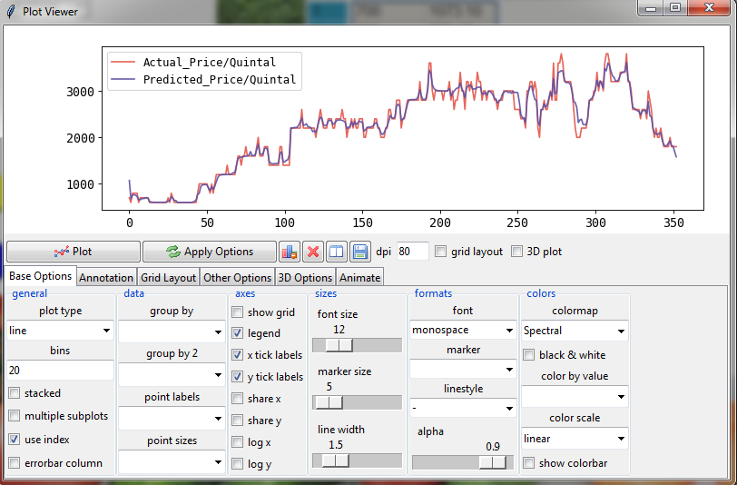

# Vegetable-Price-Prediction-using-Machine-Learning
# Final Year Project (2019-20)

This model will predict the price of vegetables in advance which in turn will be beneficial for common man as well as farmers.

## Description

### 1.1 Data Collection and Data Preprocessing

Vegetable prices are affected by several factors such as climate, supply, demand, and festival
etc. so the prediction is more difficult than ordinary commercial products. It is very difficult
to collect data based on these factors. Therefore, in this project, we have taken vegetable price
of ten commodity as experimental data. Most important point in network design is determining
the data size and frequency. This is mostly depending on the final output. For short time
forecasting daily frequency data is preferred. But normally daily data are not available. So,
weekly and monthly data are used for forecasting because it has less noise.

In this model two years of different commodity price data from 2018 and 2019 are taken for
creating the model. Taking previous monthly and weekly price of vegetables from any market
for simulating the model and later few monthly and weekly price as test data for the model.
The data are collected from the web site  

### 1.2 Data Normalization

Normalization is an important issue in Neural Network. Normalization is to transfer the data
to fit within the limit of transfer function. Data normalization used to speed up training time
by stating the training process for each feature within the same scale. There are many types of
data normalization are available, they are Z-score normalization, Minimax sigmoid etc.

## Demonstration
### Step 1 : Login 

### Step 2 : Select the Commodity and City(Market) and click predict for the following result

## Graph (Actual Price vs Predicted Price)

X-axis= Days, Y-axis= Price

1. Commodity = Brinjal, City = Bangalore

2. Commodity = Onion, City = Satara

3. Commodity = Cabbage, City = Kolkata

